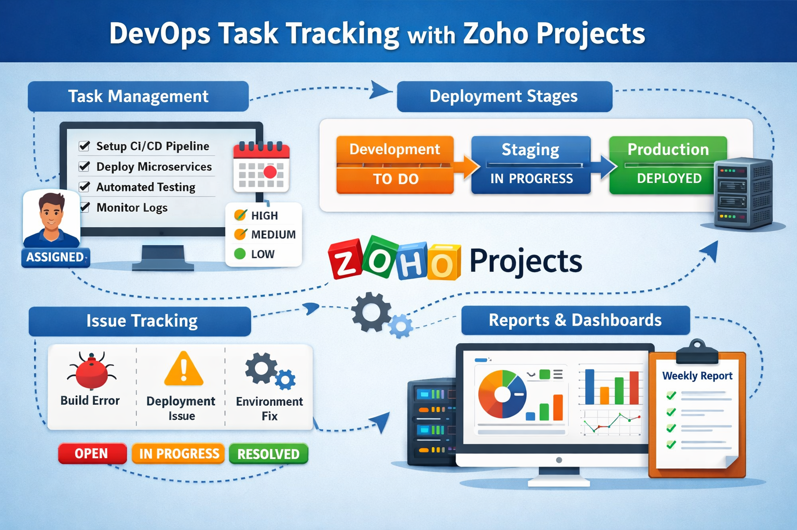

# DevOps Task Tracking using Zoho Projects / Zoho Sprints

This repository demonstrates how **Zoho Projects** or **Zoho Sprints** can be used to track DevOps tasks, deployment progress, and issue resolution in a collaborative environment.

## Overview

## What This Repository Contains
- **Zoho_DevOps_Task_Tracking.md** – Detailed workflow for managing DevOps tasks
- Task management and sprint planning
- Deployment progress tracking
- Issue tracking and resolution
- Reports and dashboards for monitoring DevOps activities

## Purpose
This repository is created as part of a DevOps Internship assessment to show my understanding of task tracking, collaboration, and deployment monitoring using Zoho tools.
